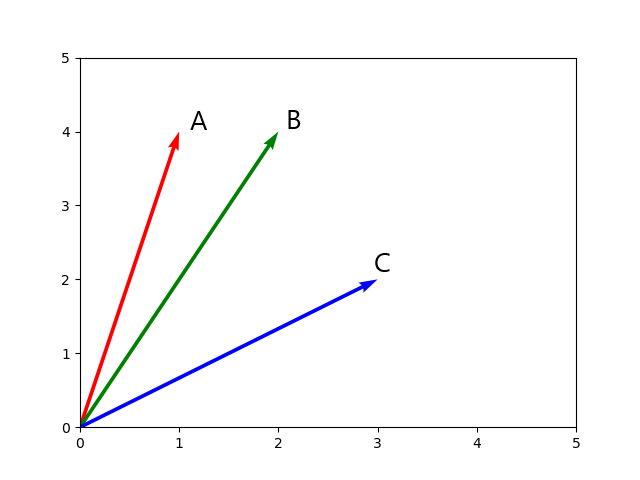
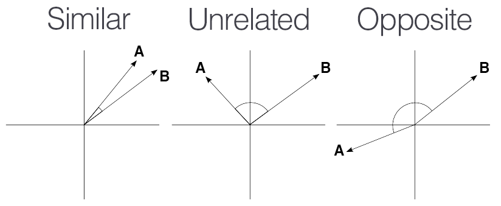

<h2><b>Text Preprocessing</b></h2>

Text preprocessing refers to the series of tasks or techniques applied to raw text data before it is used for natural language processing (NLP) or machine learning tasks. The goal of text preprocessing is to clean, normalize, and transform the text data into a format that is suitable for further analysis and modeling.

<h3><b>Tokenization</b></h3>:

Tokenization is the process of breaking down a text into smaller units, such as words or sentences.

<h3><b>Stopword Removal</b></h3>:

Stopwords are common words like "र," "हो," "छ," "यो," etc., that do not carry significant meaning. Removing stopwords can reduce noise and save computation time during model training.

<h3><b>Stemming</b></h3>:

Stemming is the technique used to reduce words to their base or root form. This helps in consolidating words with the same root, reducing the vocabulary size, and simplifying the feature space. Removes the characters like : "का", "मा", "भर", कै" Eg: 'क्रिकेटमा' and 'क्रिकेटका' both gets converted into 'क्रिकेट' which reduces the word variations and hence, the dimension of the vocabulary is reduced.

<h3><b>Removing special characters using regex</b></h3>:
Eliminating symbols, punctuations, and other non-alphanumeric characters that might not be relevant for the analysis.

<h3><b>Vectorization</b></h3>:

Machine learning algorithms cannot work with raw text directly; the text must be converted into numbers. Specifically, vectors of numbers.Transforming the text data into numerical vectors is essential for most machine learning algorithms. Techniques like one-hot encoding or word embeddings (e.g., Word2Vec, GloVe) are used for this purpose.
A popular and simple method of feature extraction with text data is called the bag-of-words model of text.

<h3><b>Bag Of Words</b></h3>:
A bag-of-words is a representation of text that describes the occurrence of words within a document. The bag-of-words (BOW) model is a representation that turns arbitrary text into fixed-length vectors by counting how many times each word appears. It involves two things:

    A vocabulary of known words.
    A measure of the presence of known words.

It represents a document as an unordered collection (or "bag") of words, ignoring grammar, word order, and context, and only considering the frequency of words in the document.

<h3><b>TF-IDF</b></h3>:
TF-IDF stands for Term Frequency-Inverse Document Frequency of records. It can be defined as the calculation of how relevant a word in a series or corpus is to a text.

<h4><b>Term Frequency</b></h4>: 
It is the measure of the frequency of words in a document. It is the ratio of the number of times the word appears in a document compared to the total number of words in that document.

tf(t,d) = count of t in d / number of words in d

The idea behind TF is to emphasize words that occur more frequently in a document as they are likely to be more relevant to the document's content.

<h4><b>Inverse Document Frequency</b></h4>
Inverse Document Frequency measures the importance of a word in the entire corpus of documents.
It is calculated by dividing the total number of documents in the corpus by the number of documents that contain the word, and then taking the logarithm of the result

The IDF score is higher for words that appear in fewer documents across the corpus, indicating their rarity and potential significance.
 log_e(Total number of documents in the corpus D / Number of documents containing the term t)
idf(t) = log(Total number of documents in the corpus D /(Number of documents containing the term t + 1))

We take log of this ratio because when the corpus becomes large IDF values can get large causing it to explode hence taking log will dampen this effect.
we cannot divide by 0, we smoothen the value by adding 1 to the denominator.

A numerical representation of text documents by considering both the local importance (Term Frequency) and the global importance (Inverse Document Frequency) of words within a corpus

<h3><b>Cosine Similarity</b></h3>
Cosine similarity is a measure of similarity between two non-zero vectors in multi-dimensional space. It is calculated as the angle between these vectors (which is also the same as their inner product).

. 

The value lies between -1 and 1. A cosine similarity of 1 means the vectors are pointing in the same direction, indicating high similarity between the documents. A similarity of 0 means the vectors are orthogonal and have no similarity, while a similarity of -1 means they are in opposite directions, indicating high dissimilarity.

<h4><b>Applications</b></h4>:

1. Document Similarity
2. Information retrieval